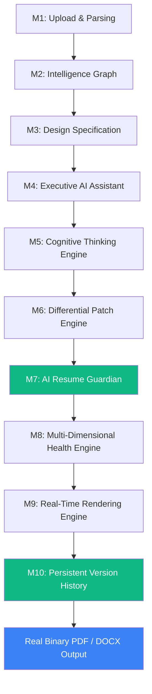

# Architecture & System Design — ResumeAI Pro (v1.0)

## 🏛️ Pipeline Overview

---

## 🔒 Core Architectural Principles

1. **Immutable Workspace**: `ResumeData` is never directly mutated by AI prompts. Edits pass through Cognitive Plan → Patch -> Guardian → Commit.
2. **Section-Scoped Differential Patching**: Edits touch ONLY specified sections in `affected_sections`. Untouched sections remain byte-for-byte identical.
3. **Guardian Safety Layer**: Every patch must pass the 5-stage Guardian validation pipeline before being committed into the version tree.
4. **Git-Inspired Persistence**: Versions are stored as immutable commits in SQLite (`db.sqlite3`). Rollbacks create new versions, preserving prior history.
5. **Deterministic Rendering**: Rendering generates a SHA-256 fingerprint from version, template, design spec, and configuration to guarantee reproducible outputs.

---

## 🧩 Component Architecture

### Backend (`backend/`)
- `main.py`: FastAPI server exposing 15+ REST endpoints, rate-limiting middleware, CORS, session auth, and ReportLab / python-docx file generators.
- `ai_provider.py`: Core AI engine orchestration (Gemini / Claude / Groq abstraction), Cognitive Planning, Patch Engine, Guardian Validation, Health Scoring, Render Fingerprinting, and SQLite Version Control.
- `db.sqlite3`: Local SQLite database storing `version_commits`, `user_sessions`, and `payments`.

### Frontend (`lib/`)
- `lib/models/`: Canonical models (`resume_model.dart`, `resume_workspace.dart`, `version_commit.dart`, `edit_plan.dart`, `patch_result.dart`, `guardian_result.dart`, `health_report.dart`, `render_report.dart`).
- `lib/services/api_service.dart`: HTTP service handling API calls to backend endpoints.
- `lib/screens/`: 10 UI screens (`landing_screen.dart`, `cv_source_screen.dart`, `cv_upload_screen.dart`, `jd_paste_screen.dart`, `form_screen.dart`, `verify_screen.dart`, `building_screen.dart`, `result_screen.dart`, `template_selector_screen.dart`, `payment_screen.dart`).
