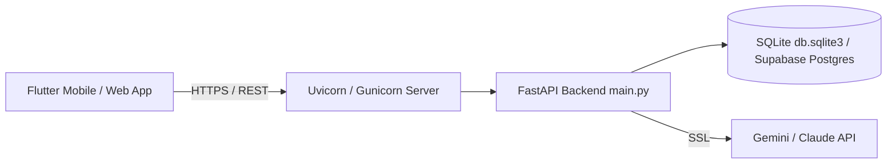

# Production Deployment Guide — ResumeAI Pro (v1.0)

## ☁️ Deployment Architecture



---

## 🛠️ Prerequisites

- Python 3.10+
- Flutter 3.20+
- SQLite 3
- Tesseract OCR (for scanned PDF/Image OCR support)

---

## 🚀 Environment Variables

Create `.env` in `backend/`:

```env
# AI Provider Configuration
AI_PROVIDER=gemini              # 'gemini' (free tier) or 'claude' (paid)
GEMINI_API_KEY=AIzaSy...        # Required if AI_PROVIDER=gemini
ANTHROPIC_API_KEY=sk-ant-...    # Required if AI_PROVIDER=claude

# Optional Supabase Database Override (Defaults to local SQLite db.sqlite3)
SUPABASE_URL=https://xyz.supabase.co
SUPABASE_KEY=eyJhbGci...

# Application Environment
ENVIRONMENT=production
PORT=8000
```

---

## 🐳 Docker Deployment

Build and run backend container:

```bash
cd backend
docker build -t resume-ai-backend .
docker run -d -p 8000:8000 --env-file .env resume-ai-backend
```

---

## 📱 Mobile App Production Build

### Android APK / AAB

```bash
flutter build apk --release
flutter build appbundle --release
```

Output path: `build/app/outputs/bundle/release/app-release.aab`
