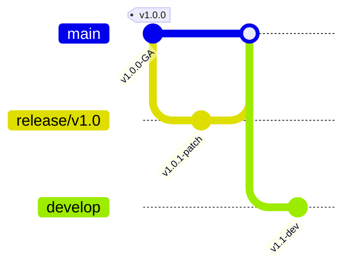

# Version Roadmap — ResumeAI Pro

This document defines the post-release versioning strategy and release policy for ResumeAI Pro.

---

## 📌 Branching Strategy

| Branch Name | Scope | Push Policy |
|-------------|-------|-------------|
| `main` | Production-only releases (`v1.0.0`, `v1.0.1`) | Protected; tagged release commits only |
| `release/v1.0` | Maintenance & patch fixes for v1.0.x | Code review required |
| `develop` | Staging area for future v1.1 release | Continuous Integration enabled |
| `hotfix/*` | Critical emergency security/production patches | Direct merge to `main` and `develop` |

---

## 🛣️ Release Roadmap

### `v1.0.x` — Maintenance & Bug Fixes (Current Active Phase)
- Strictly bug fixes, security patches, and performance tuning.
- Zero feature additions or schema changes.
- Weekly patch releases as needed (`v1.0.1`, `v1.0.2`).

### `v1.1.0` — User Feedback & Incremental Enhancements (Q4 2026)
- Mobile UX improvements based on analytics & candidate feedback.
- Additional resume templates & accent color themes.
- Enhanced multi-lingual CV parsing support (German, French, Spanish).

### `v2.0.0` — Next-Generation AI Capabilities (2027)
- Multi-agent collaborative interview simulator.
- Real-time video resume presentation generator.
- Live enterprise ATS integration connectors (Workday, Greenhouse, Lever).
